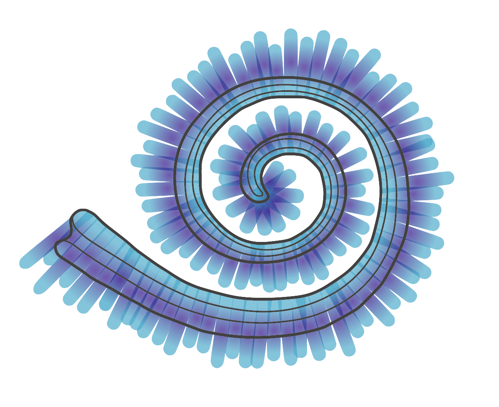

<h1 align="center">
	
  <br>
  Cochlea
  <br>
  Audio Experience Design
</h1>

<h4 align="center">
  <a href="http://nebbles.github.io/DE3-AXP-Cochlea">View the project video</a>
  <br>
</h4>

<p align="center">
	<sub>Design Engineering, Imperial College London</sub>
</p>
<br>

## Group

- Anna Bernbaum
- Shivam Bhatnagar
- Lidia Dynes Martinez
- Ben Greenberg ([@nebbles](https://github.com/nebbles))
- Jacob Mitchell
- Benjamin Pheifer

## [Arduino source code](https://github.com/nebbles/DE3-AXP-Cochlea/blob/master/src/main.cpp)

Saving the source code file to a local directory:

```bash
svn export https://github.com/nebbles/DE3-AXP-Cochlea/trunk/src/main.cpp
```

## Clone the repository

Saving the repository to a local directory:

```bash
git clone http://github.com/nebbles/DE3-AXP-Cochlea
```
